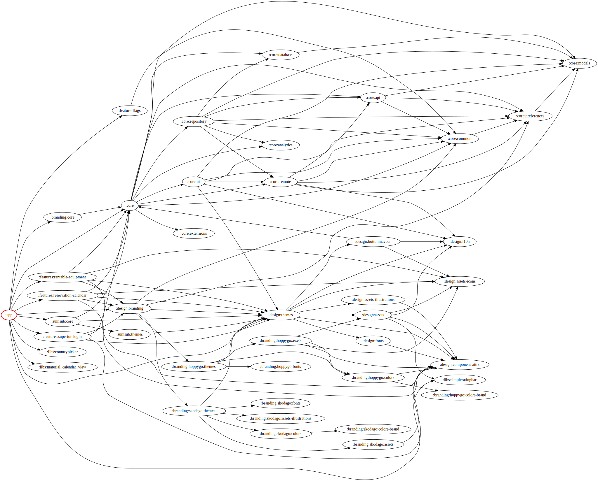

# HopyGo

## Plusy
- "single activity" - reáně má onboarding activity + main acitivty
  - dobrá navigatelnost nav graphama
  - mensí overhead - pouze fragmenty - nemusí se startovat další aktivity
- navržený design systém s oddělenými bloky
  - jednoduché rebrandování / whitelabel
  - složitější na úvodní pochopení struktury modulů
- feature flagy pro vypínání funkcionality per rebrand/whitelabel
- rozumně oddělená analytika (vše na jednom místě), kdy je možné zapínat vypínat per event kam se loguje (GA4, moengage, mixpanel)
- databinding pouze na onClick, visibility a stringy

## Mínusy
- bohužel stále není dotaženo a tak hodně věcí závisí na dalších věcech
  - nemožnost rozumného oddělení feature modulů a přenositelnost do jiného projektu
- používá společné modelové classy "na všehcno" - domain, komunikace s API i Room - změna API ovlivní i nutnost povýšit DB verzi a přepsat logiku v repository/viewmodelu
- core funkcionalita roztříštěná mezi VM a Repository (chybí jednotné místo business logiky)
- databinding
- namixované jodaTime, java time (JSR-310) i kotlin datetime :(

