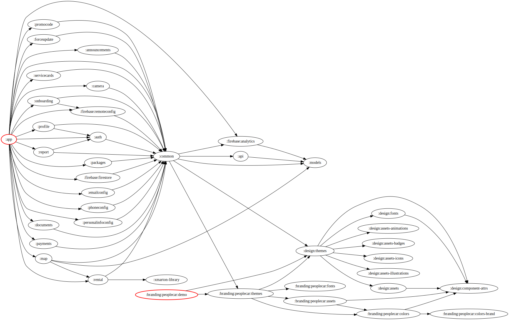

# PeopleCar

## Plusy
- o něco lépe strukturované než HoppyGo, zaměřené na feature moduly
- více oddělené vrstvy (API používá DTO, room entity), repository pomocí extensions konvertuje na domain modely - změna API nutně neovlivňuje zbytek aplikace
- samostatná aplikace pro vizuální testování designu komponent
- stringy per modul
- možnost vzít oddělený modul a přepoužít

## Mínusy
- multi activity, přepoužívání spuštěných aktivit (zahazuje backstacky, nemožnost rozumné navigace zpět)
- naprd navigace aplikací, nepoužívá standard navigation components, ale custom nástavbu
- horší udržovatelnost resources, které jsou částečně per feature module, částečně globální 
- business logika opět ve VM / repository
- neohlídané použité technologie per fragment (eventy přes livedata/channels apod), někde databinding, jinde epoxy, jinde viewholdery+adaptery
- obří použití DataBindingu na úplně všechno přes BindingAdaptery
- chybí oddělení vrstev na moduly ve feature modulu (ui/domain/data) - vývojář může sahat z UI na cokoliv - riziko prasení

